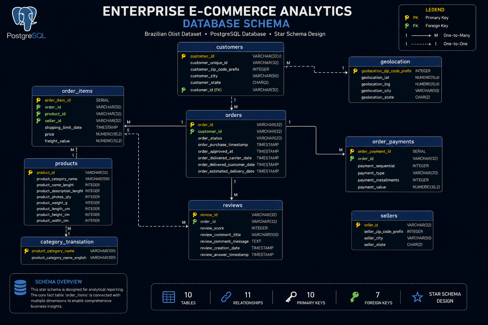
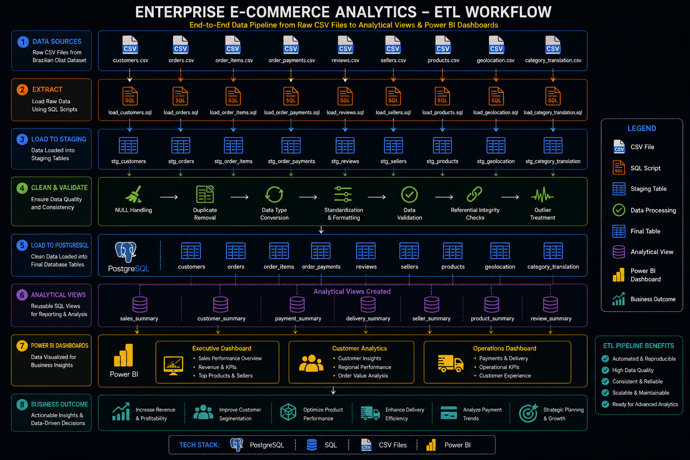
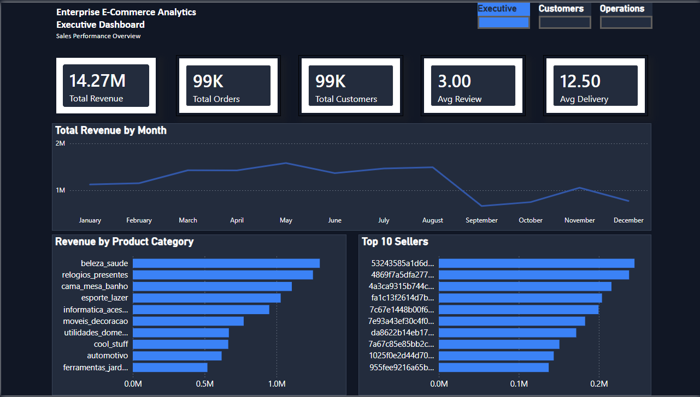
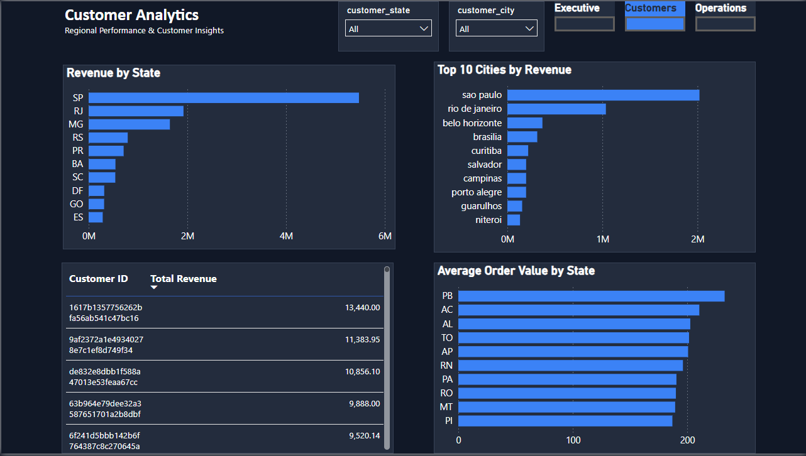
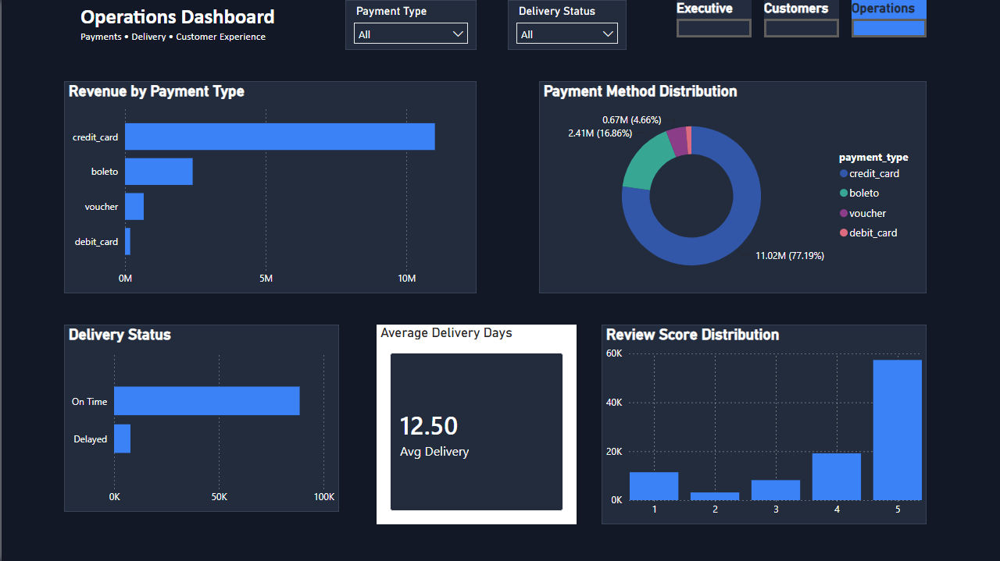

# 📊 Enterprise E-Commerce Analytics

An end-to-end Enterprise E-Commerce Analytics project built using **PostgreSQL**, **SQL**, **ETL pipelines**, and **Power BI** on the Brazilian Olist E-Commerce dataset.

The project demonstrates the complete data analytics lifecycle—from raw CSV files to database design, ETL, SQL analytics, business reporting, and interactive dashboards.

---

# 📌 Project Overview

This project simulates a real-world enterprise analytics solution for an e-commerce company.

The raw Olist Brazilian E-Commerce dataset is imported into PostgreSQL using an ETL pipeline, cleaned, transformed, and optimized for analytical reporting.

Business-focused SQL queries, analytical views, KPIs, and Power BI dashboards provide insights into sales, customers, sellers, payments, delivery performance, and product trends.

The project follows an end-to-end analytics workflow similar to what is implemented in modern Business Intelligence teams.

---

# 🛠 Tech Stack

- PostgreSQL
- SQL
- Power BI
- ETL Pipeline
- CSV Files
- Git & GitHub

---

# ✨ Features

- Enterprise PostgreSQL Database Design
- Complete ETL Pipeline
- Data Cleaning & Validation
- SQL Analytics
- Business KPI Analysis
- Window Functions
- Common Table Expressions (CTEs)
- Analytical Views
- Query Optimization
- Interactive Power BI Dashboards
- Architecture Documentation
- Database Schema
- ETL Workflow Documentation

---

# 🏗 Enterprise Architecture

The project follows a complete enterprise analytics workflow from raw data ingestion to business intelligence reporting.

  

---

# 🗄 Database Schema

The PostgreSQL database is designed using a relational schema with normalized tables connected through primary and foreign keys.

  

---

# 🔄 ETL Workflow

The ETL process extracts raw CSV files, validates and cleans the data, transforms it into structured tables, and creates analytical views for reporting.

  

---

# 📊 Power BI Dashboards

## Executive Dashboard

  

---

## Customer Analytics

  

---

## Operations Dashboard

  

